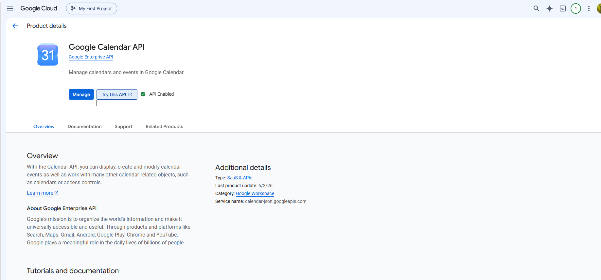
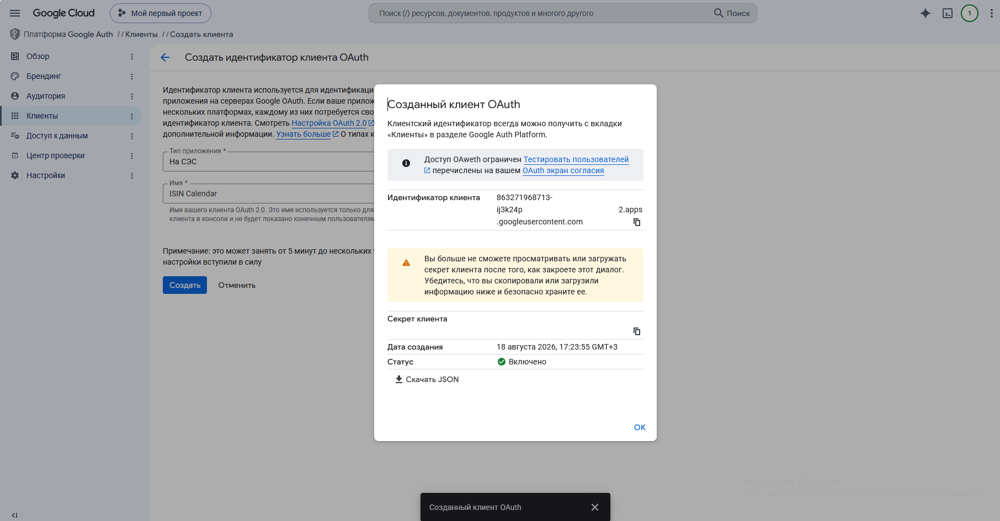
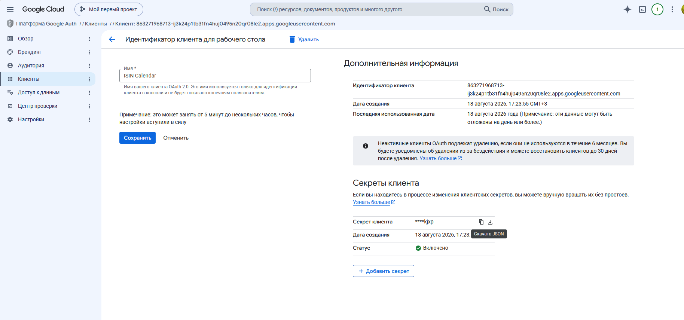

# 💰 Купонный Календарь (ISIN Calendar)

[](https://www.python.org/downloads/)
[](https://opensource.org/licenses/MIT)
[](https://github.com/psf/black)
[](https://developers.google.com/calendar)
[](https://iss.moex.com/)

[](https://t.me/ISINCalendar)
[](https://vk.ru/isincalendar)
[](https://instagram.com/isin_calendar)

Скрипт для автоматического добавления купонных выплат по облигациям в Google Календарь.  
Вы просто передаёте список ISIN облигаций, а скрипт:

- Получает актуальные данные по купонам с Московской биржи (MOEX);
- Добавляет события в ваш Google Календарь с названием, датой и суммой купона;
- Удаляет события по облигациям, которых больше нет в вашем списке;
- Не создаёт дубликаты при повторных запусках.

> Подходит для владельцев портфелей облигаций, которые хотят всегда видеть график купонных выплат в своём календаре.

---

## 📸 Скриншоты

### Пример события в Google Календаре

<p align="center">
  
  <br>
  <em>Событие с названием облигации, суммой купона и напоминанием за 24 часа</em>
</p>

### Процесс настройки Google Cloud Console

| Шаг | Описание | Скриншот |
|-----|----------|----------|
| 1 | Включение Google Calendar API |  |
| 2 | Создание OAuth 2.0 Client ID |  |
| 3 | Скачивание `credentials.json` |  |


---

## 🎥 Видео-туториал

> 🎬 **Видео-инструкция по настройке и использованию планируется к выпуску.**  
> Следите за обновлениями в репозитории или подпишитесь на канал. Cсылка появится позже.

Примерный план видео:
1. Установка Python и зависимостей.
2. Настройка Google Cloud Console (пошагово).
3. Создание файла со списком ISIN.
4. Первый запуск скрипта и авторизация.
5. Демонстрация работы — добавление событий в календарь.
6. Обновление списка и повторный запуск.

---

## 🚀 Быстрый старт

### 1. Установите зависимости

Скрипт написан на Python 3.8+. Установите необходимые библиотеки:
```bash
pip install -r requirements.txt
```
Или вручную:
```bash
pip install requests==2.31.0 google-auth==2.23.4 google-auth-oauthlib==1.0.0 google-auth-httplib2==0.1.1 google-api-python-client==2.108.0
```

### 2. Получение доступа к Google Calendar API
Чтобы скрипт мог добавлять события в ваш календарь, нужно создать OAuth 2.0 клиент в Google Cloud Console.

1. Перейдите в Google Cloud Console.

2. Создайте новый проект (или выберите существующий).

3. Включите Google Calendar API:

    - Перейдите в раздел "Библиотека"

    - Найдите "Google Calendar API" и нажмите "Включить".

4. Создайте OAuth 2.0 Client ID:

    - Перейдите в раздел "Учётные данные";

    - Нажмите "Создать учётные данные" → "ID клиента OAuth";

    - Выберите тип приложения "Десктопное приложение" (Desktop app);

    - Укажите название и нажмите "Создать".

5. Скачайте файл с учётными данными:

    - Напротив созданного клиента нажмите значок скачивания (↓);

    - Сохраните файл как credentials.json в папку со скриптом.

[Официальная документация Google Calendar API](https://developers.google.com/workspace/calendar/api/guides/overview?hl=ru)

### 3. Подготовка файла со списком ISIN
Создайте текстовый файл (например, isin_list.txt) и укажите в нём ISIN облигаций по одному на строку:
```text
RU000A10D2Y6
RU000A10D3S6
RU000A10DQ68
RU000A1097S8
```
Сохраните файл в ту же папку, где находится скрипт. Пример файла [ISIN_example.txt](https://github.com/ddependence/ISINCalendar/blob/main/examples/ISIN_example.txt)

### 4. Запустите скрипт
```bash
python isin_calendar.py isin_list.txt
```
При первом запуске откроется браузер с запросом на авторизацию в Google. Войдите в свой аккаунт и дайте разрешение на доступ к календарю. После этого будет создан файл token.json — он хранит ваш доступ и позволяет запускать скрипт без повторной авторизации.

---

## 📁 Структура проекта
ISINCalendar/
├── isin_calendar.py              # Основной скрипт
├── requirements.txt              # Зависимости
├── README.md                     # Документация
├── .gitignore                    # Защита секретов
├── LICENSE                       # Лицензия MIT
├── CHANGELOG.md                  # История изменений
├── CONTRIBUTING.md               # Правила участия
├── examples/
│   └── isin_list_example.txt    # Пример файла со списком ISIN
├── docs/
│   └── screenshots/              # Папка для скриншотов
│       ├── calendar_event_example.png
│       ├── enable_api.png
│       ├── create_oauth.png
│       └── download_credentials.png
└── .github/
    └── workflows/
        └── python-app.yml       # CI/CD (GitHub Actions)


---

## ⚙️ Как это работает

1. Чтение списка ISIN — из файла, переданного аргументом.

2. Получение данных с Мосбиржи — для каждого ISIN скрипт находит secid и запрашивает все купоны.

3. Синхронизация календаря:

   - Удаляет события по ISIN, которых больше нет в файле;

   - Добавляет события только для будущих купонов, которых ещё нет в календаре;

   - В названии события — название облигации и сумма купона.

4. Напоминания — на каждое событие устанавливается уведомление за 24 часа до даты выплаты.

---

### 📝 Пример использования

## Исходные данные
Файл isin_list.txt:

```text
RU000A10D2Y6
RU000A10D3S6
```
## Запуск

```bash 
python isin_calendar.py isin_list.txt
```
## Что произойдёт

1. Скрипт определит, что это облигации:

        ОФЗ 26244 (ISIN: RU000A10D2Y6)

        ОФЗ 26245 (ISIN: RU000A10D3S6)

2. Получит все будущие купоны:

        ОФЗ 26244: 15.12.2026 → 38.74 ₽

        ОФЗ 26245: 12.08.2026 → 37.36 ₽

3. Добавит в Google Календарь события:

        Купон ОФЗ 26244 38.74 ₽ на 15.12.2026

        Купон ОФЗ 26245 37.36 ₽ на 12.08.2026

## Вывод в консоли

```text
Найдено 2 ISIN для обработки.

➜ Получаем существующие события в календаре...
  Найдено 0 событий, созданных скриптом.

➜ Получаем актуальные данные по купонам...

  Обработка RU000A10D2Y6...
    ✓ Найдено: ОФЗ 26244 (RU000A10D2Y6)
    ✓ Найдено 12 будущих купонов.

  Обработка RU000A10D3S6...
    ✓ Найдено: ОФЗ 26245 (RU000A10D3S6)
    ✓ Найдено 14 будущих купонов.

➜ Добавляем новые события...
  ✓ Добавлено: Купон ОФЗ 26244 38.74 ₽ на 2026-12-15
  ✓ Добавлено: Купон ОФЗ 26245 37.36 ₽ на 2026-08-12

✅ Готово!
  Добавлено событий: 2
  Удалено событий: 0
  Всего в календаре теперь: 2 событий 
  ```

---

### 🔄 Обновление списка облигаций

Вы можете в любой момент изменить список в isin_list.txt и повторно запустить скрипт.
Будут автоматически:

✅ удалены события по удалённым ISIN;

✅ добавлены события по новым ISIN;

✅ обновлены данные по купонам.

---

### 🧩 Требования

- Python 3.8 или выше

- Аккаунт Google с включённым Calendar API

- Доступ к интернету (для запросов к MOEX и Google API)

Точные версии библиотек (из requirements.txt)

```text

requests==2.31.0
google-auth==2.23.4
google-auth-oauthlib==1.0.0
google-auth-httplib2==0.1.1
google-api-python-client==2.108.0
```

---

### 🪟 Инструкция для Windows
## Быстрая установка Git

1. Скачайте Git с официального сайта: https://git-scm.com/download/win

2. Установите с настройками по умолчанию

3. Проверьте установку:
```cmd
git --version
```

## Создание Personal Access Token (PAT)
1. GitHub → Settings → Developer settings → Personal access tokens → Tokens (classic)

2. Нажмите "Generate new token (classic)"

3. Выберите срок действия (рекомендуется 90 дней)

4. Отметьте repo (все)

5. Скопируйте сгенерированный токен (показывается только один раз!)

## Публикация проекта
Откройте командную строку в папке с проектом и выполните:

```cmd
# Инициализация Git
git init

# Настройка имени и email
git config --global user.name "Ваше Имя"
git config --global user.email "your.email@example.com"

# Добавление файлов
git add .

# Создание коммита
git commit -m "Initial commit: Добавлен скрипт ISIN Calendar"

# Переименование ветки
git branch -M main

# Подключение к GitHub
git remote add origin https://github.com/ВАШ_ЛОГИН/isin-calendar.git

# Отправка на GitHub (вместо пароля введите Personal Access Token)
git push -u origin main
```

### Синхронизация с Android (Poco / Xiaomi HyperOS)
## Проблема: на HyperOS не синхронизируется календарь
1. Установите из Google Play приложение "Google Календарь"
2. Откройте его и войдите в свой аккаунт
3. Дождитесь загрузки данных
4. Удалите приложение Google Календарь
5. Зайдите в Настройки → Аккаунты → Google → Синхронизация аккаунта
6. Теперь переключатель "Календарь" должен появиться и работать

### Для всех телефонов Android
1. Настройки → Аккаунты → Google → Синхронизация → включите "Календарь"
2. Откройте приложение "Календарь" → меню → выберите аккаунт
3. Нажмите "Обновить"

---

### ⚠️ Важные замечания
🔒 Скрипт использует публичный API Мосбиржи без ключей — работает без регистрации.

📅 Все события создаются в основном календаре Google (можно изменить на любой другой, указав calendar_id в коде).

🔐 В credentials.json и token.json хранятся данные доступа — не публикуйте их в открытом доступе.

📁 Убедитесь, что эти файлы добавлены в .gitignore (это уже сделано).

📊 Скрипт обрабатывает до 2500 событий за один запуск — этого достаточно для большинства портфелей.

---

### 🤝 Вклад в проект

Если вы хотите улучшить скрипт или добавить новую функциональность — создавайте Pull Request или открывайте Issue. Будем рады любой помощи! 

## Планы по развитию
 - Добавить поддержку других брокеров и источников данных (например, Cbonds, Finam)
 - Возможность выбора конкретного календаря (не только primary)
 - Поддержка корпоративных облигаций и еврооблигаций
 - Веб-интерфейс для управления списком ISIN
 - Экспорт в .ics файл для импорта в другие календари
 - Уведомления в Telegram о предстоящих выплатах
 - Поддержка облигаций с плавающим купоном

---

### 📄 Лицензия

Проект распространяется под лицензией MIT. Подробнее — в файле [LICENSE](https://github.com/ddependence/ISINCalendar/blob/main/LICENSE).

---

### 🙋 Вопросы и поддержка

Если возникли проблемы при настройке или запуске — создайте Issue в этом репозитории.
Мы постараемся ответить как можно быстрее.
Быстрые ссылки

    [📂 Репозиторий на GitHub](https://github.com/ddependence/ISINCalendar)

    [🐛 Сообщить об ошибке](https://github.com/ddependence/ISINCalendar/issues)

    [📖 Документация Google Calendar API](https://developers.google.com/calendar)

    [📊 API Мосбиржи](https://iss.moex.com/)

---

### «Часто задаваемые вопросы» (FAQ)

```text
**Вопрос:** Что делать, если после запуска пишет `ModuleNotFoundError`?  
**Ответ:** Убедитесь, что вы установили все зависимости из `requirements.txt` командой `pip install -r requirements.txt`.

**Вопрос:** Где взять ISIN облигаций?  
**Ответ:** ISIN можно найти на сайте Московской биржи, в торговом терминале или в отчёте брокера. 
```
---

### 🌟 Звёздочка

Если проект вам полезен — поставьте ⭐️ на GitHub! Это поможет другим пользователям найти его.

Удачи с вашими инвестициями и пусть купоны приходят вовремя! 🚀

---

### 📝 Автор

[Алексей Мортин - ddependence](https://vk.ru/ddependence) — разработчик и автор проекта

---

### 🏷️ Теги

python google-calendar-api moex bonds coupons finance investing portfolio-management calendar-sync fixed-income russian-bonds automation isin купонный-календарь